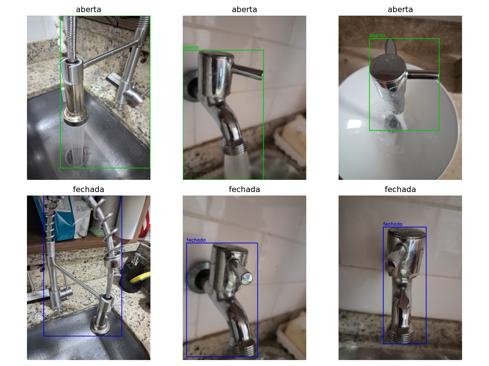
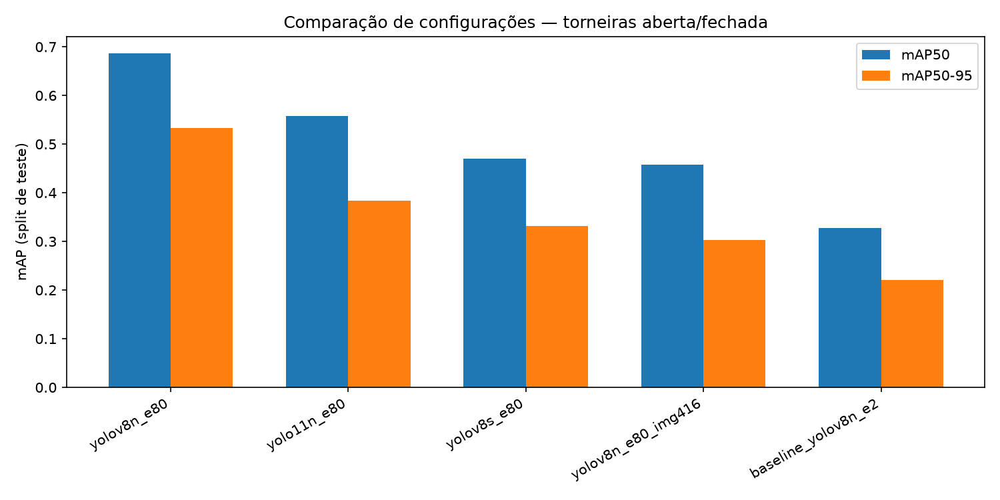
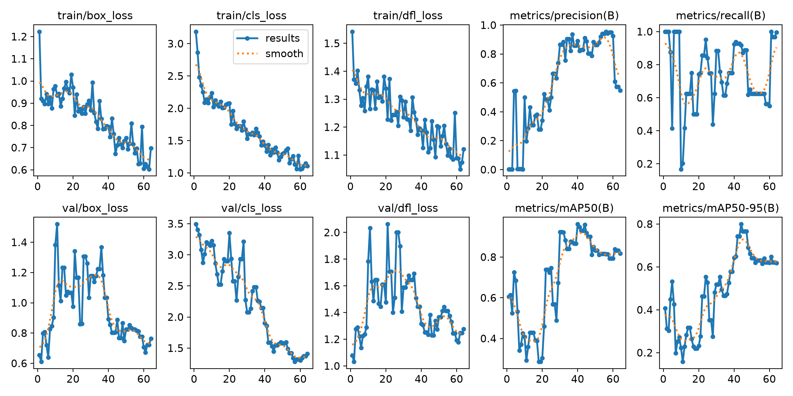
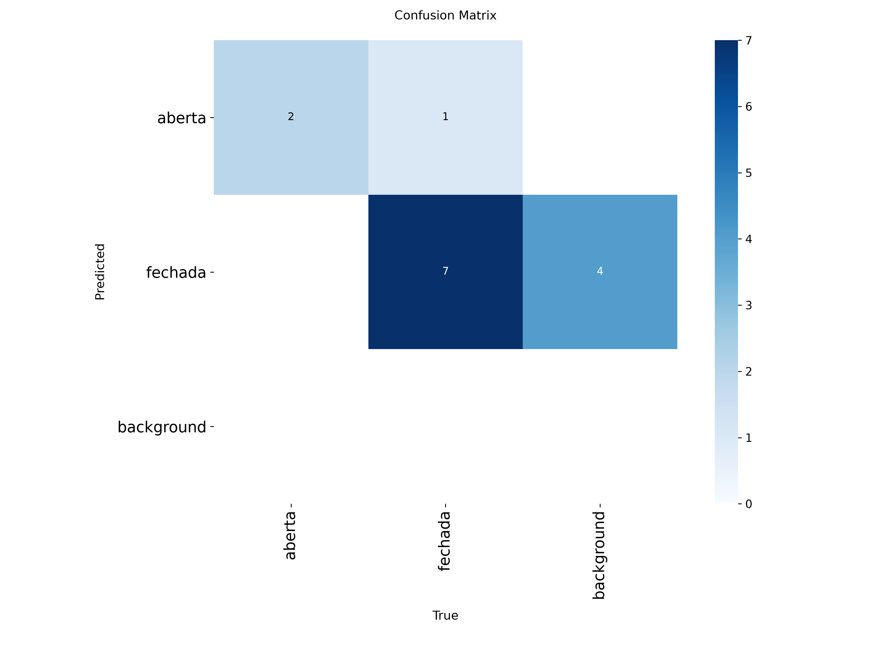
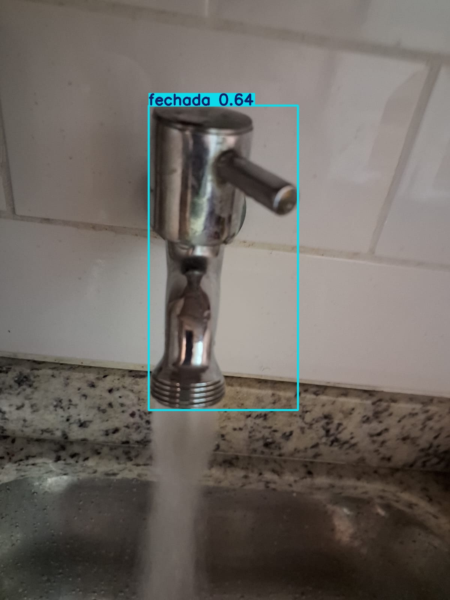
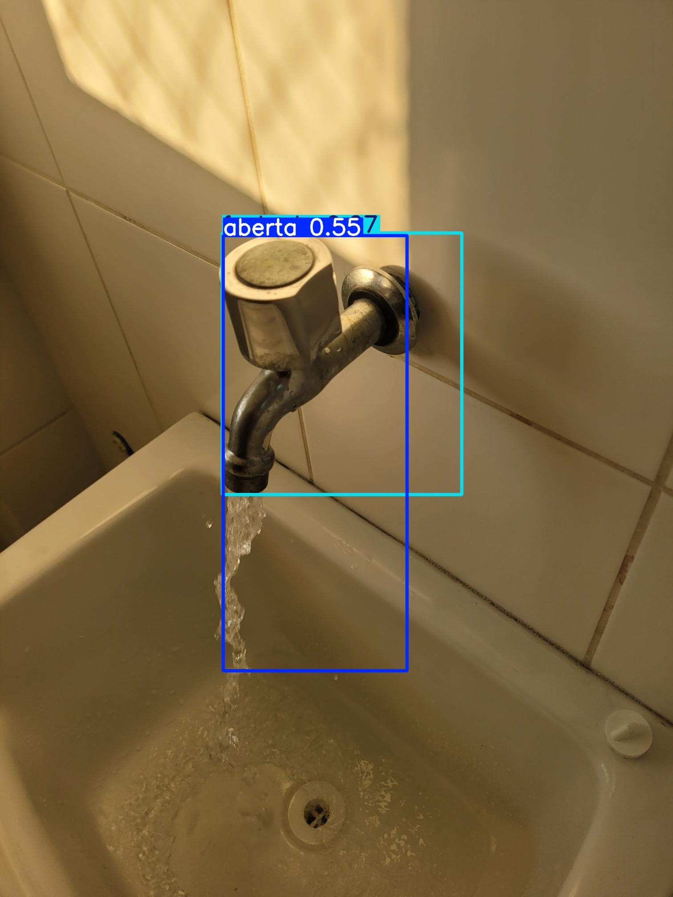

# Project 2 — Desafio Semana 5 (Visão Computacional)

Detecção de **estado** de um objeto com YOLO — torneira **aberta** vs. **fechada** (Residência em IA, UniSENAI — Prof. Matheus Vanzan).

## Objetivo

Treinar um modelo YOLO capaz de distinguir dois estados de um mesmo objeto (torneira aberta/fechada com base na presença do jato de água), usando um mini-dataset autoral fotografado pelo grupo, anotado e exportado em formato COCO.

## Conexão com a indústria

Detectar se uma torneira está aberta ou fechada por visão computacional é o mesmo problema, em miniatura, que diversas inspeções industriais baseadas em **estado visual de um equipamento**:

- **Monitoramento de válvulas em linhas de processo** (água, vapor, óleo, gás): confirmar visualmente se uma válvula está aberta/fechada quando o sensor de posição não é confiável ou não existe, útil como camada redundante de SCADA/CLP.
- **Detecção de vazamento/fluxo**: a presença do jato de água é análoga à presença de fluido escoando em um ponto que deveria estar seco — usado em inspeção de juntas, drenos e conexões.
- **Gestão hídrica/energética**: identificar torneiras, registros ou válvulas deixados abertos indevidamente (desperdício de água em ambientes industriais, hospitalares ou residenciais), disparando um alarme.
- **Inspeção de painéis e maquinário**: o mesmo princípio (estado A vs. estado B do mesmo objeto, não dois objetos diferentes) se aplica a luzes indicadoras ligadas/apagadas, registros de gás abertos/fechados e portas de segurança.

## Dataset

- **Fonte**: mini-dataset autoral (`torneiras-vc-final`), fotografado pelo grupo e anotado/exportado via [Roboflow](https://roboflow.com) em formato **COCO**.
- **69 imagens**, 1 bounding box por imagem (exceto uma, sem anotação no export original — ver Análise de erros), 2 classes: `aberta` (jato de água visível) e `fechada` (torneira seca).
- **Splits originais do export**: 48 treino / 10 validação / 11 teste.
- **Diversidade**: contribuições de ~10 pessoas (prefixo `s01`...`s10`), cobrindo torneiras de cozinha e banheiro, diferentes modelos (monocomando, gravetes, bica alta/baixa), ângulos, distâncias, fundos e condições de iluminação (natural/artificial, quente/fria).
- O split de **teste** nunca é usado em treino/validação — ele faz o papel das "fotos novas tiradas depois do treinamento" pedidas no enunciado.



Estrutura:
```
data/
  raw/        # dataset original em COCO (train/valid/test + _annotations.coco.json)
  yolo/       # gerado por scripts/coco_to_yolo.py (images/ + labels/ + data.yaml) — não versionado
```

## Metodologia

1. **Conversão COCO → YOLO** (`scripts/coco_to_yolo.py`): remapeia as categorias COCO (descartando a categoria-raiz do projeto Roboflow) para classes YOLO 0-indexed e normaliza as bounding boxes.
2. **Transfer learning**: todos os modelos partem de pesos pré-treinados em COCO (`yolov8n`, `yolov8s`, `yolo11n`) — com só 48 imagens de treino, treinar do zero não é viável.
3. **Grid de experimentos** (`scripts/train.py`), variando exatamente o que o desafio pede ("teste diferentes versões, configurações"):

   | Config | Modelo | Épocas | Resolução | Objetivo |
   |---|---|---|---|---|
   | `baseline_yolov8n_e2` | YOLOv8n | 2 | 640 | baseline obrigatório (poucas épocas) |
   | `yolov8n_e80` | YOLOv8n | 80 (patience=20) | 640 | configuração "padrão" otimizada |
   | `yolov8n_e80_img416` | YOLOv8n | 80 (patience=20) | 416 | efeito de reduzir a resolução |
   | `yolov8s_e80` | YOLOv8s | 80 (patience=20) | 640 | efeito de um modelo maior |
   | `yolo11n_e80` | YOLO11n | 80 (patience=20) | 640 | efeito de uma versão mais nova do YOLO |

   Todos os treinos rodaram em **CPU** (ambiente sem GPU), com `batch=8`, `cache=True` (dataset cabe inteiro em RAM) e `seed=0` fixo para reprodutibilidade.
4. **Avaliação** no split de teste (11 imagens nunca vistas) com métricas padrão de detecção: precisão, recall, mAP50 e mAP50-95.
5. **Inspeção visual** das predições no teste (`scripts/predict_samples.py`) para listar acertos e erros imagem a imagem.

## Resultados

| Config | Modelo | Épocas | Resolução | Precisão | Recall | mAP50 | mAP50-95 | Tempo treino |
|---|---|---|---|---|---|---|---|---|
| `yolov8n_e80` | yolov8n.pt | 80 | 640 | 0.652 | 0.646 | 0.687 | 0.533 | 751s |
| `yolo11n_e80` | yolo11n.pt | 80 | 640 | 0.003 | 0.938 | 0.558 | 0.384 | 285s |
| `yolov8s_e80` | yolov8s.pt | 80 | 640 | 0.461 | 0.633 | 0.471 | 0.332 | 784s |
| `yolov8n_e80_img416` | yolov8n.pt | 80 | 416 | 0.003 | 0.938 | 0.458 | 0.303 | 134s |
| `baseline_yolov8n_e2` | yolov8n.pt | 2 | 640 | 0.003 | 0.938 | 0.328 | 0.221 | 32s |

*(métricas no split de teste — 11 imagens nunca usadas em treino/validação; tabela gerada por `scripts/make_report.py`, ordenada por mAP50)*



**Melhor configuração: `yolov8n_e80`** (YOLOv8n, até 80 épocas com early stopping, 640px) — mAP50=0.687, mAP50-95=0.533. Conclusões do grid:

- **O baseline de 2 épocas é claramente insuficiente** (mAP50=0.328), confirmando a necessidade de treinar até convergir.
- **Treinar mais (com early stopping) é o que mais importa**: `yolov8n_e80` ganha +0.359 de mAP50 sobre o baseline só por treinar até convergir (parou em 64/80 épocas, melhor peso na época 44 — `patience=20` evitou overfitting sem precisar fixar manualmente o nº de épocas).
- **Reduzir a resolução para 416px piora bastante o resultado** (mAP50=0.458 vs. 0.687): como o estado do objeto depende de um detalhe fino (o jato de água), menos pixels significam menos informação para diferenciar `aberta`/`fechada`.
- **Um modelo maior não ajuda aqui** (`yolov8s_e80`, mAP50=0.471, pior que o yolov8n): com só 48 imagens de treino, a capacidade extra do YOLOv8s faz overfitting mais rápido (early stop já na época 7) em vez de generalizar melhor.
- **YOLO11n fica no meio do caminho** (mAP50=0.558): treina mais rápido (early stop na época 3, 285s) que o `yolov8n_e80`, mas não supera a arquitetura YOLOv8 — mais madura/testada — neste dataset pequeno.

Por classe, o melhor modelo (`yolov8n_e80`) no split de teste:

| Classe | Precisão | Recall | mAP50 | mAP50-95 |
|---|---|---|---|---|
| `aberta` | 0.821 | 0.625 | 0.660 | 0.356 |
| `fechada` | 0.482 | 0.667 | 0.715 | 0.710 |

`aberta` tem menos falsos positivos (precisão maior), mas `fechada` tem caixas mais bem localizadas (mAP50-95 maior) — ver hipótese na análise de erros abaixo.

**Nota sobre a coluna "Precisão"**: em 4 das 5 configs ela aparece artificialmente baixa (~0.003) mesmo com recall alto. É um artefato do `model.val()` do Ultralytics, que escolhe o limiar de confiança que maximiza o F1 médio ao longo de toda a curva precisão-recall — com um split de teste tão pequeno (11 imagens, 11 caixas no total) esse ponto ótimo pode coincidir com um limiar bem baixo, onde o modelo já emite detecções espúrias de baixa confiança (ver "Análise de erros"). O mAP50/mAP50-95 integra a curva inteira e por isso é a métrica usada para ordenar a tabela; só o `yolov8n_e80`, por ter convergido melhor, chegou a um modelo calibrado o suficiente para não sofrer esse efeito.

Curvas de treino (loss, P/R/mAP por época) e matriz de confusão do melhor modelo:




## Análise de erros

Predições do melhor modelo (`yolov8n_e80`) nas 11 imagens de teste (nunca vistas em treino/validação), limiar de confiança padrão (`conf=0.25`), geradas por `scripts/predict_samples.py`:

| Imagem | Ground truth | Predito | Confiança | Resultado |
|---|---|---|---|---|
| s01_aberta_001 | aberta | fechada | 0.659 | ERRO |
| s01_aberta_002 | aberta | aberta | 0.554 | OK |
| s02_aberta_002 | aberta | fechada | 0.635 | ERRO |
| s03_aberta_002 | *(sem anotação)* | *(nenhuma)* | — | OK\* |
| s04_aberta_004 | aberta | aberta, aberta | 0.641 / 0.317 | ERRO |
| s04_fechada_008 | fechada | fechada | 0.506 | OK |
| s05_fechada_002 | fechada | fechada, aberta | 0.877 / 0.597 | ERRO |
| s06_aberta_003 | aberta | aberta | 0.918 | OK |
| s06_aberta_004 | aberta, aberta | aberta, aberta | 0.911 / 0.263 | OK |
| s08_aberta_001 | aberta | aberta, fechada | 0.546 / 0.269 | ERRO |
| s10_fechada_002 | fechada | aberta, fechada | 0.791 / 0.350 | ERRO |

**5/11 (45%) corretas** com correspondência exata de classes — bem mais baixo do que o mAP50 (0.687) sugere, porque aqui qualquer caixa extra ou trocada já conta como erro de imagem inteira. Relatório completo em [`results/artifacts/test_predictions_report.json`](results/artifacts/test_predictions_report.json), imagens anotadas em `results/artifacts/predictions/`.

\* `s03_aberta_002` não tem nenhuma bounding box no export COCO original (falha de anotação do próprio dataset, não do modelo) — o modelo corretamente não detecta nada, mas o par não chega a testar a classificação de estado.

### Padrão 1 — Confusão de classe quando o jato de água fica fora/na borda da caixa (2 casos)

Em `s01_aberta_001` e `s02_aberta_002` a torneira está de fato aberta (jato de água visível na foto), mas o modelo prediz `fechada` com confiança razoável (0.66 e 0.64). Nos dois casos a bounding box de ground truth — desenhada em torno da torneira/bica — cobre pouco ou nada do jato, que fica majoritariamente abaixo/fora da caixa:



Como o sinal mais óbvio de "aberta" (o jato) fica fora da região que o detector usa para classificar, o modelo precisa diferenciar os dois estados só pela aparência da peça metálica — reflexos, gotas, sombra — um sinal bem mais sutil e menos confiável com poucas imagens de treino (~24 por classe).

### Padrão 2 — Caixa espúria duplicada, geralmente da classe errada (4 casos)

Em `s04_aberta_004`, `s05_fechada_002`, `s08_aberta_001` e `s10_fechada_002` o modelo acerta a caixa principal mas emite uma segunda detecção de confiança mais baixa (0.26–0.60) sobre o fundo (parede, azulejo) ou duplicando o mesmo objeto. Exemplo em `s08_aberta_001`: a caixa azul (`aberta`, 0.55) está correta e cobre até o jato de água, mas uma segunda caixa ciano (`fechada`, 0.27) aparece sobre o azulejo ao lado:



Esse é o padrão de erro mais comum (4 das 6 imagens erradas) e explica a métrica de "Precisão" artificialmente baixa discutida em Resultados: com só 48 imagens de treino — todas com exatamente 1 objeto —, o modelo nunca viu volume suficiente de "fundo puro" para aprender a suprimir com confiança uma segunda caixa em texturas neutras (azulejo, granito, rosca metálica).

### Possíveis mitigações

- Anotar a bounding box cobrindo explicitamente o jato de água quando presente, para o detector aprender o sinal certo em vez de depender só da peça metálica.
- Mais imagens de treino, principalmente de fundos variados sem o objeto, para o modelo aprender a suprimir caixas espúrias.
- Pós-processar mantendo só a detecção de maior confiança por imagem, já que o problema sempre tem exatamente 1 torneira por foto.

## Como rodar

```bash
pip install ultralytics

# 1. Converter o dataset COCO para YOLO
python3 scripts/coco_to_yolo.py --src data/raw --dst data/yolo

# 2. Treinar todas as configurações do grid
python3 scripts/train.py --configs all
# ou uma config especifica:
python3 scripts/train.py --configs yolov8n_e80

# 3. Gerar tabela comparativa + grafico + copiar artefatos do melhor modelo
python3 scripts/make_report.py

# 4. Rodar o melhor modelo nas imagens de teste e gerar o relatorio de acertos/erros
python3 scripts/predict_samples.py --weights results/runs/<melhor_config>/weights/best.pt
```

## Decisões técnicas

- **`device=cpu`**: ambiente de treino sem GPU disponível; o dataset é pequeno o suficiente para isso não ser um problema (cada época de YOLOv8n leva ~10-15s).
- **`cache=True`**: com apenas 69 imagens, cabem inteiras em RAM — evita reler/decodificar JPEG a cada época.
- **Pesos pré-treinados (COCO)** em vez de treino do zero: 48 imagens de treino não são suficientes para aprender features visuais do zero.
- **`patience=20`** nos treinos longos: early stopping para evitar overfitting num dataset tão pequeno, sem precisar fixar manualmente o número ideal de épocas.
- **Split de teste do próprio export** usado como "imagens novas": como o Roboflow já separa um holdout de 11 imagens nunca usadas em treino/validação, ele cumpre o papel de "fotos tiradas depois do treinamento" exigido no enunciado.
- **`batch=8`**: dataset pequeno (48 imagens de treino) — batches maiores não trariam benefício e o `optimizer=auto` do Ultralytics já ajusta o LR para o batch size.
